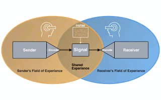

# Manim Animations

This is a repo for my manim animations.

## Communication Animation

[](./src/manim-communication.py)

[](./src/media-decision.py)

[](./src/radar-chart.py)

## Installation 

This repo uses `uv` in order to manage dependencies.

```
$ uv sync
$ uv run manim  --resolution "1280,720" src/manim-communication.py CommunicationModel
```

To generate gifs:

```
$ uv run manim -r 320,240 --format=gif src/manim-communication.py CommunicationModel
```

Media files will be output into the `media/` directory.

